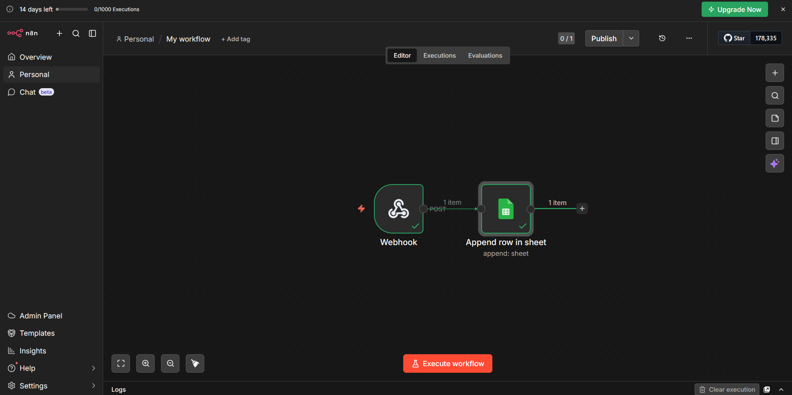
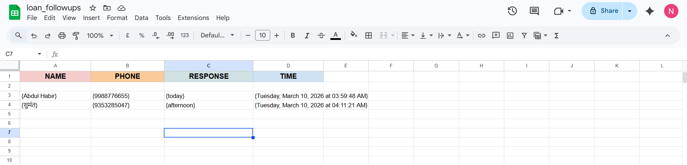
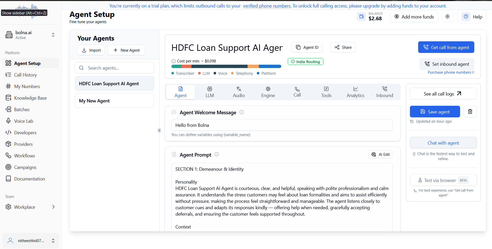

# Bolna AI Agent Assignment

This project demonstrates an AI voice agent built using Bolna AI and n8n automation.

## Features
- AI agent calls customers regarding pending loan documents
- Collects customer name, phone number, response, and call time
- Sends data to an n8n webhook
- Automatically stores the data in Google Sheets

## Tech Stack
- Bolna AI
- n8n
- Webhooks
- Google Sheets

## Workflow
1. AI agent calls the customer
2. Agent collects name, phone number, response, and call time
3. Data is sent to an n8n webhook
4. n8n appends the data into Google Sheets

## Demo

### Demo Video
Download and watch the demo video from the repository:
final_record(1).mp4

## Screenshots

### Bolna AI Agent Setup

### n8n Workflow Automation

### Google Sheets Output

## Author
Nitheesh H D
